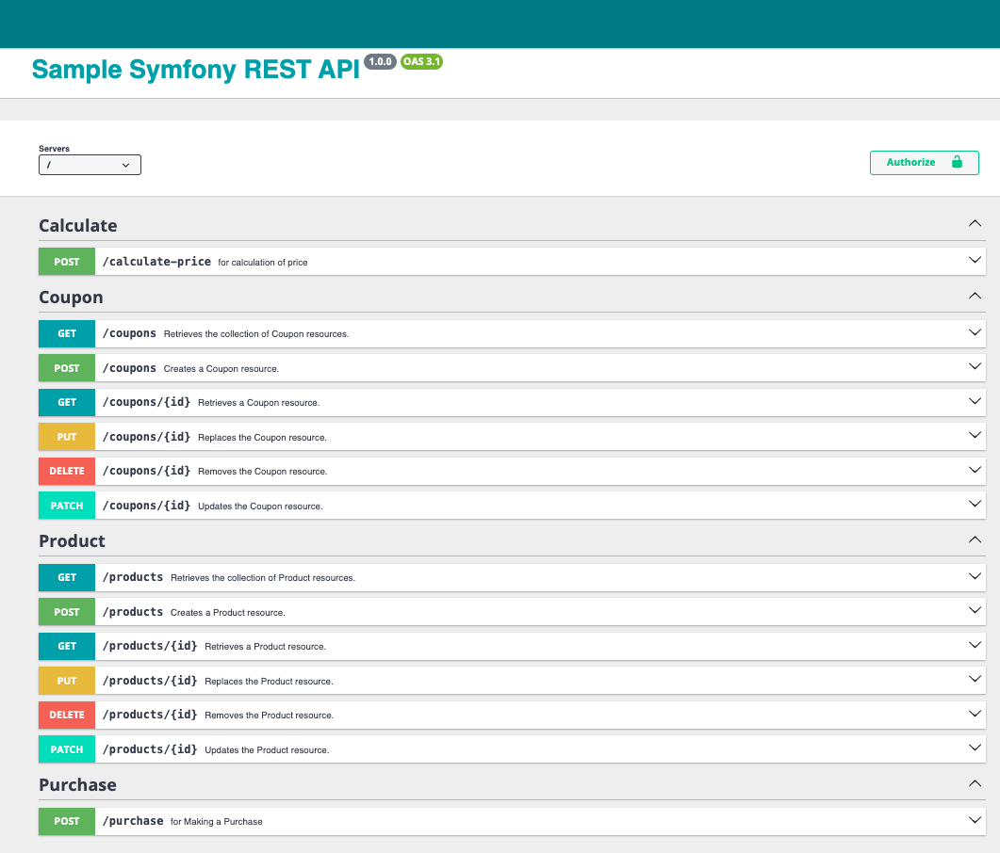

#  REST API
***
Symfony REST application for calculating product prices and processing payments.

### Requirements:
```
docker (https://www.docker.com)
```
### Installation:
```
docker compose up
```

### Provisions:
Go and access your docker php container:
```
docker exec -it your_php_container_name_or_id /bin/bash
```

Load the fixtures:
```
php bin/console doctrine:fixtures:load
```

URL: https://localhost



### Unit Tests:
Make sure you are inside of your docker php container
```
bin/phpunit
```
